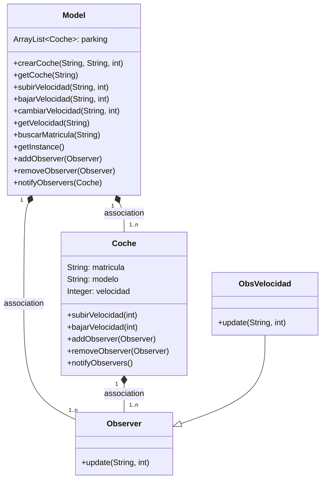
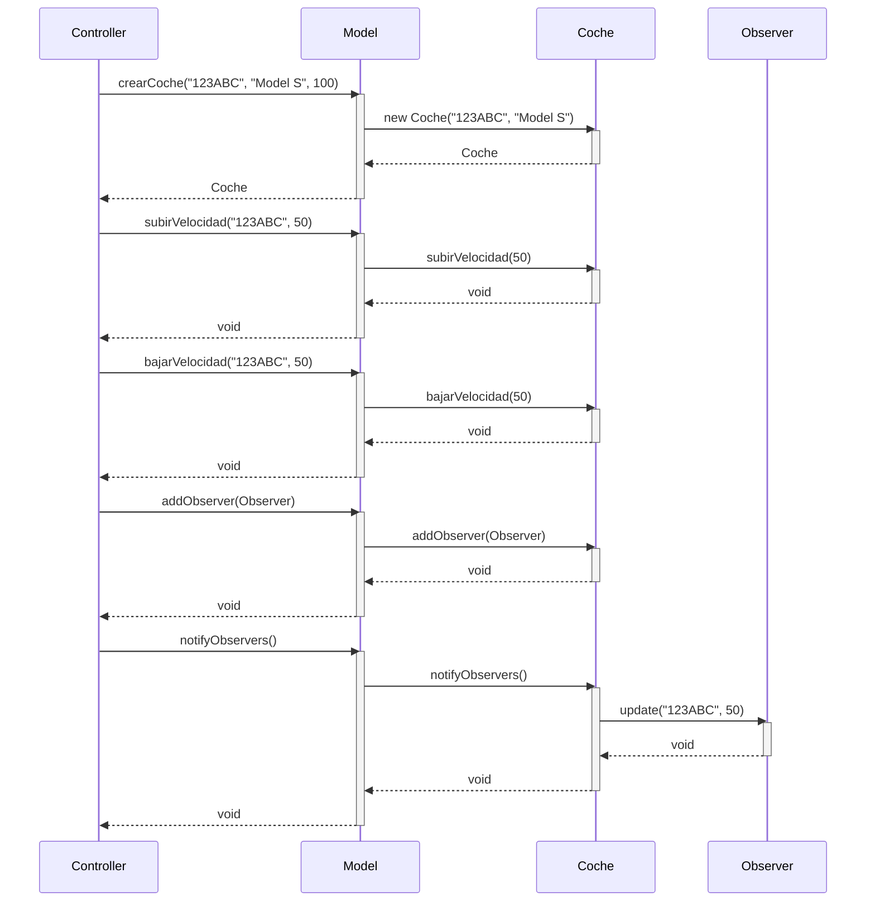
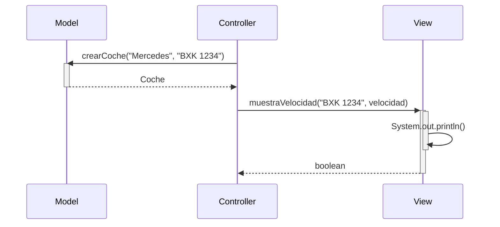

# Tarea: arquitectura MVC

Tarea para implementar arquitectura MVC

Utiliza objetos coches, modifica la velocidad y la muestra

---

## Clases ```Controller``` y ```Model```

- Implementa la clase ```Controller``` y ```Model``` según el diagrama de clases.

- Implementa los métodos ```crearCoche()```, ```getCoche()```, ```cambiarVelocidad()``` y ```getVelocidad()```

- Realiza los test necesarios para comprobar que funcionan correctamente

### Diagrama de clases:



---

### Diagrama de Secuencia

Ejemplo básico del procedimiento, sin utilizar los nombres de los métodos




El mismo diagrama con los nombres de los métodos



### Examen 3
## Primera Parte

Editamos la clase Model para añadir un Singleton. Lo que vamos a hacer es que el constructor sea privado y añadir un método estático que devuelva la instancia de la clase. 

```java
public class Model {
    private static Model instance = null;
    private ArrayList<Coche> parking;

    private Model() {
        parking = new ArrayList<>();
    }

    public static Model getInstance() {
        if (instance == null) {
            instance = new Model();
        }
        return instance;
    }
    
}
```
Todo esto lo hacemos en una rama nueva llamada "examen3".

## Segunda Parte
Aqui vamos a añadir a Model un método para buscar un coche por su matricula. 

```java
 public static Coche buscarMatricula(String matricula){
    for (Coche coche : parking){
        if (coche.matricula.equals(matricula)){
            return coche;
        }
    }
    return null;
}
```
Este método lo vamos a implementar en la clase Controller.

Luego tendremos que implementarlo a otras clases distintas. Por ejemplo en controller:

```java
public void buscarYMostrarCoche(String matricula) {
        Coche coche = Model.getInstance().buscarMatricula(matricula);
        View.mostrarCoche(coche);
    }
```
Aqui lo que hacemos es buscar el coche por su matricula y luego mostrarlo.

Luego lo implementamos en la clase View:

```java
public static void mostrarCoche(Coche coche) {
    if (coche != null) {
        System.out.println("Matrícula: " + coche.matricula);
        System.out.println("Modelo: " + coche.modelo);
        System.out.println("Velocidad: " + coche.velocidad);
    } else {
        System.out.println("No se encontró el coche.");
    }
}
```
Por último, lo implementamos en la clase App.