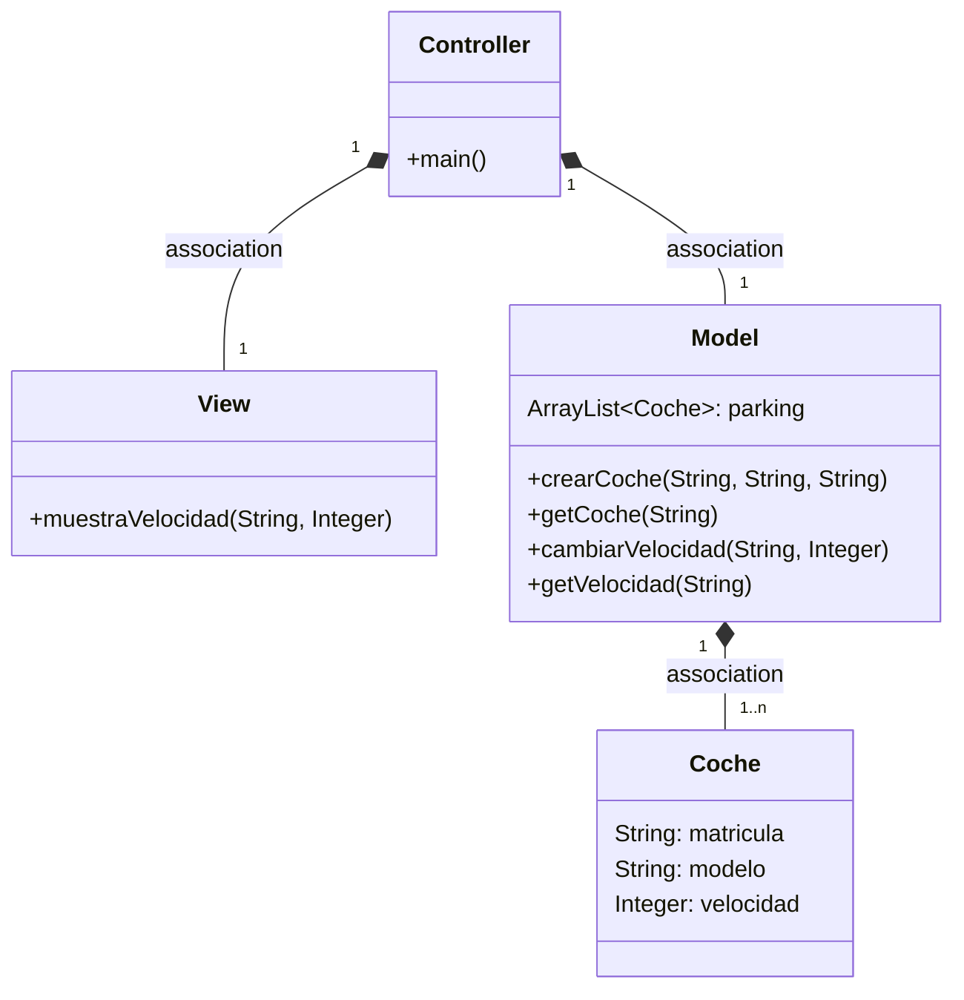
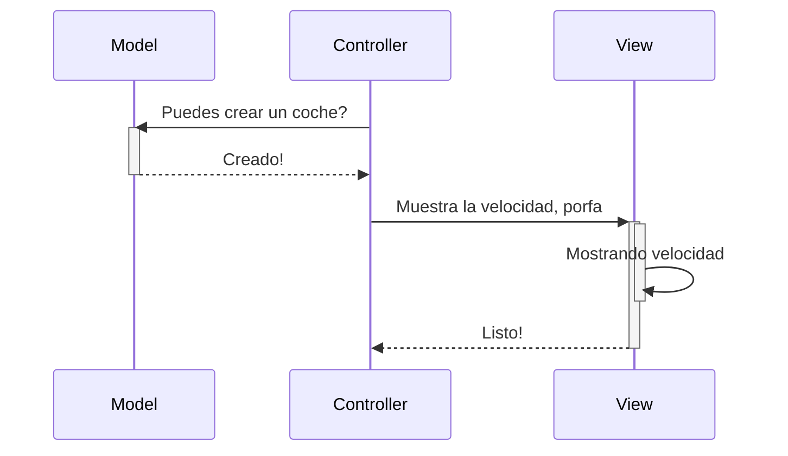
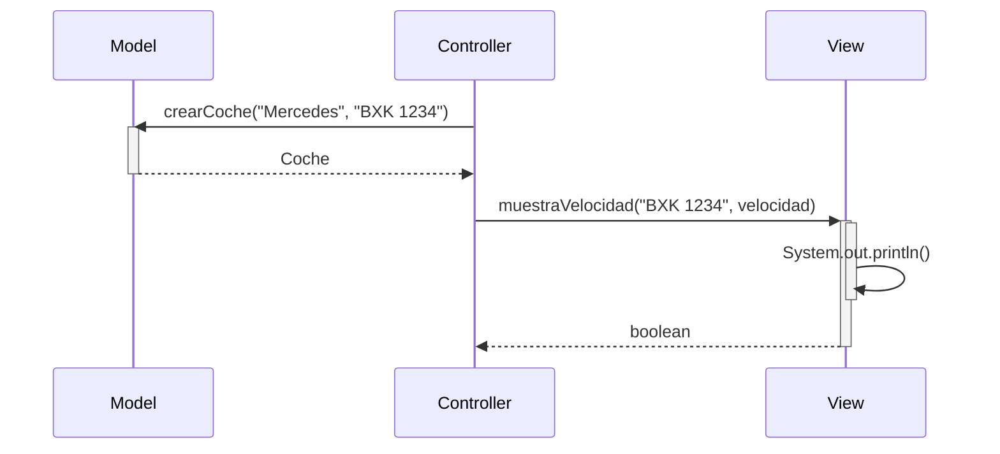

# Tarea: arquitectura MVC

Tarea para implementar arquitectura MVC

Utiliza objetos coches, modifica la velocidad y la muestra

---

## Clases ```Controller``` y ```Model```

- Implementa la clase ```Controller``` y ```Model``` según el diagrama de clases.

- Implementa los métodos ```crearCoche()```, ```getCoche()```, ```cambiarVelocidad()``` y ```getVelocidad()```

- Realiza los test necesarios para comprobar que funcionan correctamente

### Diagrama de clases:



---

### Diagrama de Secuencia

Ejemplo básico del procedimiento, sin utilizar los nombres de los métodos




El mismo diagrama con los nombres de los métodos



### Examen 3

Editamos la clase Model para añadir un Singleton. Lo que vamos a hacer es que el constructor sea privado y añadir un método estático que devuelva la instancia de la clase. 

```java
public class Model {
    private static Model instance = null;
    private ArrayList<Coche> parking;

    private Model() {
        parking = new ArrayList<>();
    }

    public static Model getInstance() {
        if (instance == null) {
            instance = new Model();
        }
        return instance;
    }
    
}
```
Todo esto lo hacemos en una rama nueva llamada "examen3".